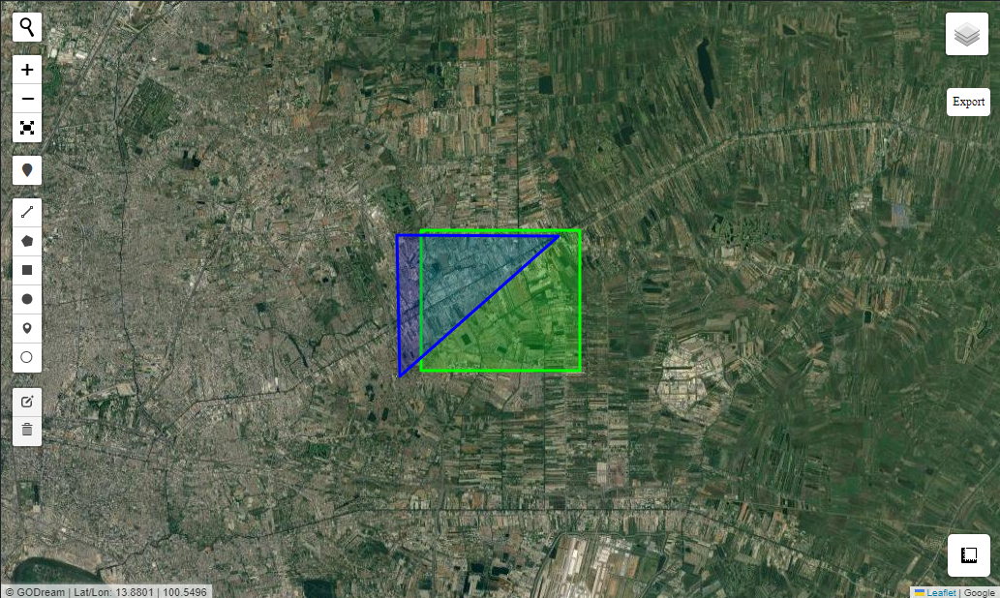
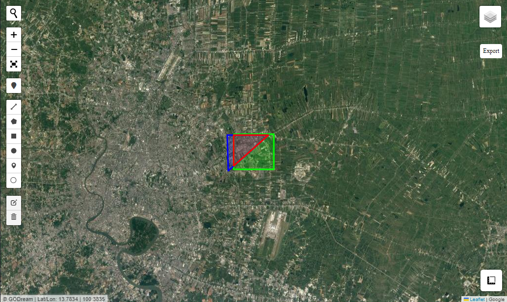
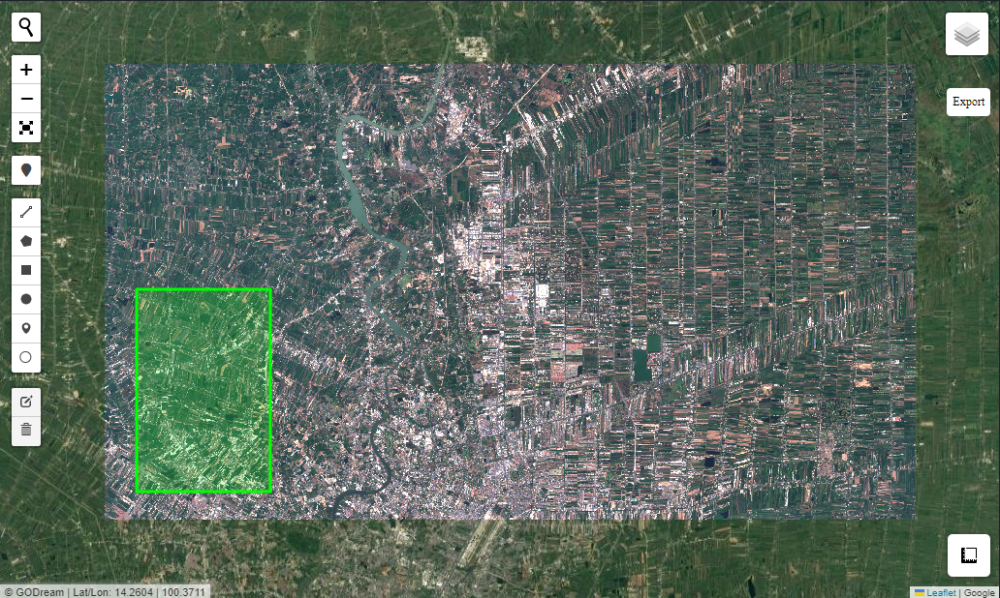
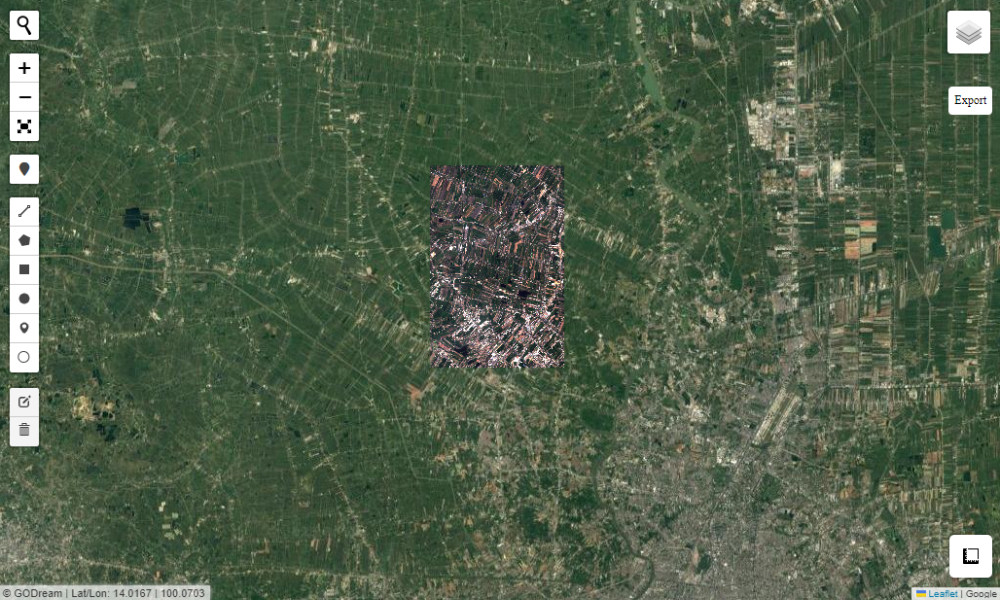

# Geoprocessing 

Geoprocessing tools including:

- merge
- intersect
- union
- erase
- clip (!!!can work with raster)
- smc_difference
- dissolve
- buffer

Every tools can work with vector data.

This case study will show you Intersect tools and Clip tools


### load package


```python
import geopandas as gpd
from Godream.geobox import intersect
from Godream.plotimg import overlay_map
```

## Intersect


```python
First_path = "D:\DGEO\data\square.geojson"
secound_path= "D:\DGEO\data\Triangle.geojson"
```


```python
# display input file on interative map
files=[First_path,secound_path]
overlay_map(files, zoom=12)
```



### Using intersect function


```python
# input path
paths=[First_path,secound_path]
out_path="D:\DGEO\data\intersect_out.geojson"

# output path
intersect(paths, out_path)
```

### Output intersect


```python
#display intersect result on interative map
result_files = [First_path, secound_path, out_path]

overlay_map(result_files)
```




## Clip Raster by Vector


```python
input_path='D:\DGEO\data\S2_image3.tif' # raster
clip_path = 'D:\DGEO\data\Rectan.geojson' # vector
output_path= 'D:\DGEO\data\Raster_clip.tif'
```


```python
# display input file on interative map

filev = [clip_path]
filer = [input_path]

overlay_map(filev,filer)
```



### Using clip function


```python
from Godream.geobox import clip
```


```python
clip(input_path,clip_path, output_path)
```

### Output clip raster


```python
filer = [output_path]

overlay_map(raster_file=filer, with_draw_tools=True )
```




