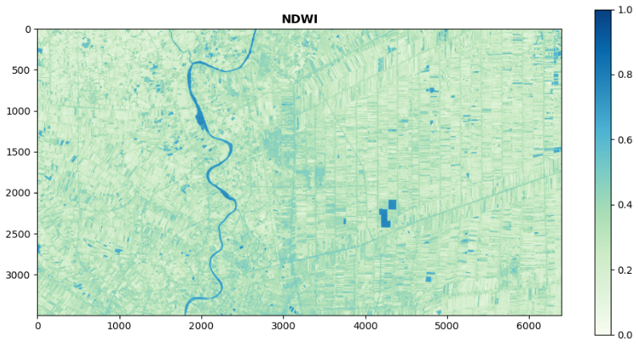

# Bands Analyze

This is a tutorial for creating band index manually.

### Import Package


```python
import numpy as np
from Godream.convertool import xarray_ds
from Godream.plotimg import plot_raster
```

### Create xarray dataset 

Create xarray dataset from raster image.


```python
file_name = "D:\DGEO\data\S2_image3.tif"
ds = xarray_ds(tiff_path=file_name)
```


```python
print(ds)
```

    <xarray.Dataset>
    Dimensions:  (y: 3495, x: 6396)
    Coordinates:
      * x        (x) float64 100.3 100.3 100.3 100.3 ... 100.9 100.9 100.9 100.9
      * y        (y) float64 13.93 13.93 13.93 13.93 ... 14.24 14.24 14.24 14.24
    Data variables:
        band_1   (y, x) float64 577.0 580.0 598.0 619.0 ... 781.0 712.0 665.0 681.0
        band_2   (y, x) float64 926.0 919.0 933.0 929.0 ... 957.0 942.0 928.0
        band_3   (y, x) float64 1.045e+03 1.066e+03 1.07e+03 ... 1.093e+03 1.101e+03
        band_4   (y, x) float64 3.195e+03 3.246e+03 ... 2.338e+03 2.279e+03
    Attributes:
        crs:        EPSG:4326
        transform:  | 0.00, 0.00, 100.34|
                    | 0.00,-0.00, 14.24|
                    | 0.00, 0.00, 1.00|
    

### Explore dataset

band1, band2, band3, band4 represent to band red, green, blue, nir , Respectively.


```python
print(ds.band_1)
```


    <xarray.DataArray 'band_1' (y: 3495, x: 6396)>
    array([[ 577.,  580.,  598., ...,  832.,  866.,  830.],
           [ 599.,  614.,  593., ...,  855.,  847.,  836.],
           [ 583.,  579.,  591., ...,  822.,  832.,  847.],
           ...,
           [ 659.,  674.,  703., ...,  817.,  986., 1050.],
           [ 640.,  656.,  674., ...,  816.,  723.,  758.],
           [ 664.,  661.,  656., ...,  712.,  665.,  681.]])
    Coordinates:
      * x        (x) float64 100.3 100.3 100.3 100.3 ... 100.9 100.9 100.9 100.9
      * y        (y) float64 13.93 13.93 13.93 13.93 ... 14.24 14.24 14.24 14.24
    


### Create new band index

This case study will create Normalised Difference Water Index (NDWI).

from formular: 

NDWI = (green-nir)/(green+nir)


```python
ndwi = (ds.band_2 - ds.band_4) / (ds.band_2 + ds.band_4)

print(ndwi)
```

    <xarray.DataArray (y: 3495, x: 6396)>
    array([[-0.55059452, -0.55870348, -0.55219582, ..., -0.46666667,
            -0.41126332, -0.39923469],
           [-0.56552372, -0.55311184, -0.57056639, ..., -0.4763675 ,
            -0.44396428, -0.40887923],
           [-0.57918552, -0.57726218, -0.55842328, ..., -0.52091067,
            -0.48203354, -0.43473125],
           ...,
           [-0.5193658 , -0.50948571, -0.45927835, ..., -0.29016949,
            -0.40574215, -0.3456057 ],
           [-0.50832747, -0.50718031, -0.50153121, ..., -0.2952183 ,
            -0.44366197, -0.37531646],
           [-0.48443157, -0.49062426, -0.51581781, ..., -0.29941435,
            -0.42560976, -0.42126598]])
    Coordinates:
      * x        (x) float64 100.3 100.3 100.3 100.3 ... 100.9 100.9 100.9 100.9
      * y        (y) float64 13.93 13.93 13.93 13.93 ... 14.24 14.24 14.24 14.24
    

### Explore index output"


```python
# convert xarray to numpy array
NDWI = ndwi.values
```


```python
# plot image
plot_raster(NDWI, cmap='GnBu', title= 'NDWI', adjust=True, figsize=(12,6), gamma=0.8)
```




<!--  -->


