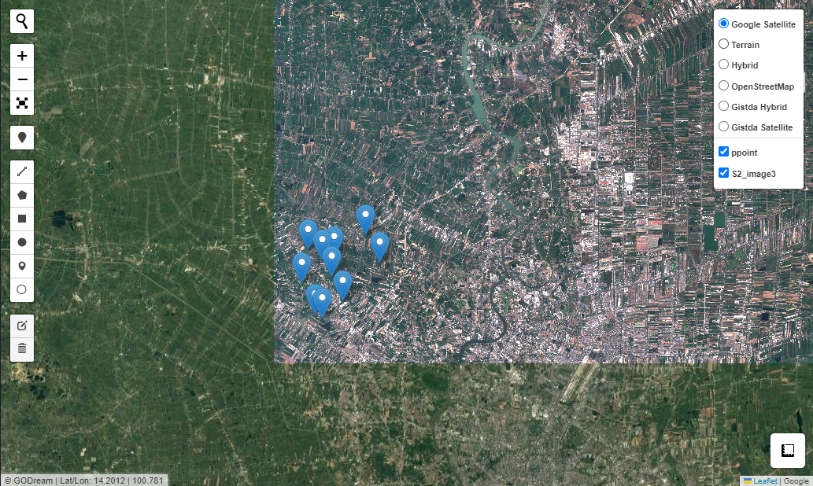

# Extract by point

Extract data of raster image from points

### Import package


```python
import geopandas as gpd
from Godream.geobox import extract_by_point
from Godream.plotimg import overlay_map
```

### Explore Input data


```python
raster = 'D:/DGEO/data/S2_image3.tif'
points = 'D:/DGEO/data/ppoint.geojson'
output_vector = 'D:/DGEO/data/ppoint_1.geojson'
```


```python
gdf = gpd.read_file(points)
gdf.head()
```


<div>
<style scoped>
    .dataframe tbody tr th:only-of-type {
        vertical-align: middle;
    }

    .dataframe tbody tr th {
        vertical-align: top;
    }

    .dataframe thead th {
        text-align: right;
    }
</style>
<table border="1" class="dataframe">
  <thead>
    <tr style="text-align: right;">
      <th></th>
      <th>geometry</th>
    </tr>
  </thead>
  <tbody>
    <tr>
      <th>0</th>
      <td>POINT (100.38786 13.99795)</td>
    </tr>
    <tr>
      <th>1</th>
      <td>POINT (100.42939 14.00995)</td>
    </tr>
    <tr>
      <th>2</th>
      <td>POINT (100.41725 14.03318)</td>
    </tr>
    <tr>
      <th>3</th>
      <td>POINT (100.38942 14.01469)</td>
    </tr>
    <tr>
      <th>4</th>
      <td>POINT (100.36727 14.02073)</td>
    </tr>
  </tbody>
</table>
</div>


```python
# display input file on interative map
overlay_map(vector_file= [points], raster_file=[raster])
```




### Extract data by points


```python
extract_by_point(raster, points, output_vector)

```


<div>
<style scoped>
    .dataframe tbody tr th:only-of-type {
        vertical-align: middle;
    }

    .dataframe tbody tr th {
        vertical-align: top;
    }

    .dataframe thead th {
        text-align: right;
    }
</style>
<table border="1" class="dataframe">
  <thead>
    <tr style="text-align: right;">
      <th></th>
      <th>geometry</th>
      <th>band_1</th>
      <th>band_2</th>
      <th>band_3</th>
      <th>band_4</th>
    </tr>
  </thead>
  <tbody>
    <tr>
      <th>0</th>
      <td>POINT (100.38786 13.99795)</td>
      <td>569.0</td>
      <td>956.0</td>
      <td>1062.0</td>
      <td>2796.0</td>
    </tr>
    <tr>
      <th>1</th>
      <td>POINT (100.42939 14.00995)</td>
      <td>659.0</td>
      <td>1018.0</td>
      <td>1086.0</td>
      <td>3080.0</td>
    </tr>
    <tr>
      <th>2</th>
      <td>POINT (100.41725 14.03318)</td>
      <td>606.0</td>
      <td>967.0</td>
      <td>1078.0</td>
      <td>3102.0</td>
    </tr>
    <tr>
      <th>3</th>
      <td>POINT (100.38942 14.01469)</td>
      <td>641.0</td>
      <td>988.0</td>
      <td>1078.0</td>
      <td>2954.0</td>
    </tr>
    <tr>
      <th>4</th>
      <td>POINT (100.36727 14.02073)</td>
      <td>766.0</td>
      <td>1047.0</td>
      <td>1146.0</td>
      <td>2454.0</td>
    </tr>
    <tr>
      <th>5</th>
      <td>POINT (100.37963 14.01217)</td>
      <td>597.0</td>
      <td>942.0</td>
      <td>1075.0</td>
      <td>3165.0</td>
    </tr>
    <tr>
      <th>6</th>
      <td>POINT (100.36129 13.99269)</td>
      <td>703.0</td>
      <td>1090.0</td>
      <td>1126.0</td>
      <td>3046.0</td>
    </tr>
    <tr>
      <th>7</th>
      <td>POINT (100.39729 13.97719)</td>
      <td>771.0</td>
      <td>1085.0</td>
      <td>1174.0</td>
      <td>2787.0</td>
    </tr>
    <tr>
      <th>8</th>
      <td>POINT (100.37916 13.96268)</td>
      <td>635.0</td>
      <td>973.0</td>
      <td>1113.0</td>
      <td>3142.0</td>
    </tr>
    <tr>
      <th>9</th>
      <td>POINT (100.37298 13.96574)</td>
      <td>598.0</td>
      <td>953.0</td>
      <td>1077.0</td>
      <td>2666.0</td>
    </tr>
  </tbody>
</table>
</div>


### Output


```python
# Read the vector 
gdf = gpd.read_file(output_vector)

gdf.head()
```


<div>
<style scoped>
    .dataframe tbody tr th:only-of-type {
        vertical-align: middle;
    }

    .dataframe tbody tr th {
        vertical-align: top;
    }

    .dataframe thead th {
        text-align: right;
    }
</style>
<table border="1" class="dataframe">
  <thead>
    <tr style="text-align: right;">
      <th></th>
      <th>band_1</th>
      <th>band_2</th>
      <th>band_3</th>
      <th>band_4</th>
      <th>geometry</th>
    </tr>
  </thead>
  <tbody>
    <tr>
      <th>0</th>
      <td>569.0</td>
      <td>956.0</td>
      <td>1062.0</td>
      <td>2796.0</td>
      <td>POINT (100.38786 13.99795)</td>
    </tr>
    <tr>
      <th>1</th>
      <td>659.0</td>
      <td>1018.0</td>
      <td>1086.0</td>
      <td>3080.0</td>
      <td>POINT (100.42939 14.00995)</td>
    </tr>
    <tr>
      <th>2</th>
      <td>606.0</td>
      <td>967.0</td>
      <td>1078.0</td>
      <td>3102.0</td>
      <td>POINT (100.41725 14.03318)</td>
    </tr>
    <tr>
      <th>3</th>
      <td>641.0</td>
      <td>988.0</td>
      <td>1078.0</td>
      <td>2954.0</td>
      <td>POINT (100.38942 14.01469)</td>
    </tr>
    <tr>
      <th>4</th>
      <td>766.0</td>
      <td>1047.0</td>
      <td>1146.0</td>
      <td>2454.0</td>
      <td>POINT (100.36727 14.02073)</td>
    </tr>
  </tbody>
</table>
</div>


