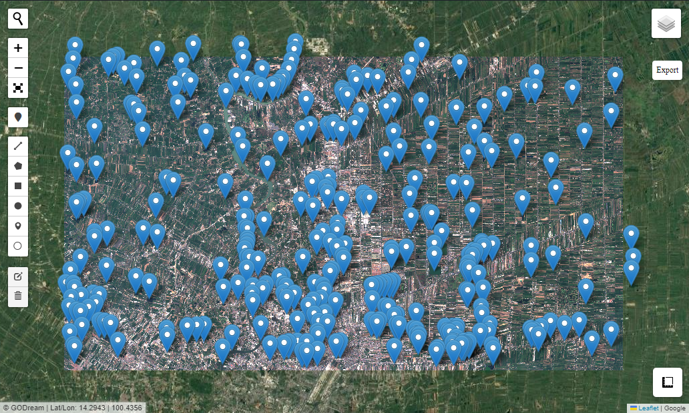
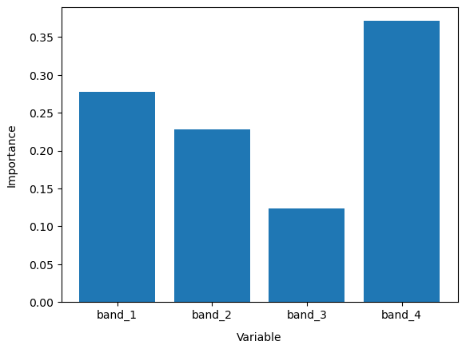
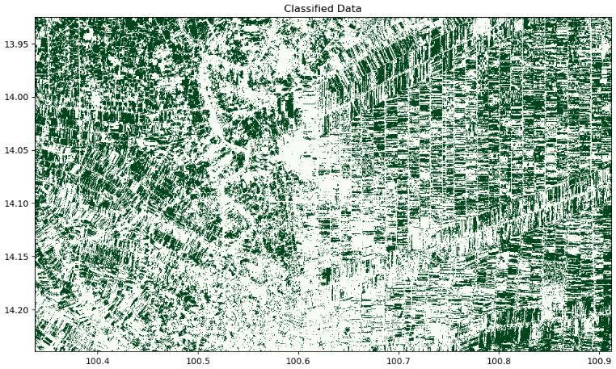

# ML

Machine Learning for Classification

### Import package


```python
import numpy as np
import matplotlib.pyplot as plt
import rasterio 
import rioxarray
import geopandas as gpd
import numpy as np

from sklearn import model_selection
from sklearn.ensemble import RandomForestClassifier
from sklearn.metrics import accuracy_score
from Godream.plotimg import overlay_map
from Godream.convertool import xarray_ds, geojson_add_Newcol
from Godream.geobox import extract_by_point, merge
from Godream.classification import predict_xray
```

### Set Input


```python
file_name = "data/S2_image3.tif" # raster image file
v1 = 'data/rice_point.geojson'   # point of rice in vector
v2 = 'data/urban_point.geojson'  # point of urban in vector 
v3 = 'data/water_point.geojson'  # point of water in vector
vector = [v1, v2, v3]
filer = [file_name]
```

### Display input

It may take several minute to display map.

As you can see the 3 diferance type of land use in 3 vector files. That is consist of rice, urban and water.


```python
#Visualize vector and raster files
overlay_map(vector_file=vector , raster_file = filer, with_draw_tools=True,zoom=None )
```




### Create Xarray dataset 

Create Xarray dataset from raster image

Use 'xarray_ds' to convert raster image to xarray dataset


```python
# create xarray dataset
ds = xarray_ds(tiff_path=file_name)

```

### Data preparation

####  Add new colume 

Add new colume to set code value to identify the type of landuse.

The case study set new column name : "class".

And value of each column was sapareted to these:

Code 111 : padd field /
     222 : Urban /
     333 : water


```python
geojson_add_Newcol('D:/DGEO/DGEO/data/water_point.geojson')
```


```python
points= 'data/rice_point.geojson'

gdf = gpd.read_file(points)
gdf.head()
```


<div>
<style scoped>
    .dataframe tbody tr th:only-of-type {
        vertical-align: middle;
    }

    .dataframe tbody tr th {
        vertical-align: top;
    }

    .dataframe thead th {
        text-align: right;
    }
</style>
<table border="1" class="dataframe">
  <thead>
    <tr style="text-align: right;">
      <th></th>
      <th>class</th>
      <th>geometry</th>
    </tr>
  </thead>
  <tbody>
    <tr>
      <th>0</th>
      <td>111</td>
      <td>POINT (100.66825 14.12306)</td>
    </tr>
    <tr>
      <th>1</th>
      <td>111</td>
      <td>POINT (100.68223 14.13092)</td>
    </tr>
    <tr>
      <th>2</th>
      <td>111</td>
      <td>POINT (100.58157 14.14916)</td>
    </tr>
    <tr>
      <th>3</th>
      <td>111</td>
      <td>POINT (100.58988 14.15341)</td>
    </tr>
    <tr>
      <th>4</th>
      <td>111</td>
      <td>POINT (100.85970 14.18962)</td>
    </tr>
  </tbody>
</table>
</div>


####  Merge file together


```python
out_trainset = 'data/trainset.geojson'

merge(vector, out_trainset )
```


```python
# explore merged output
gdf = gpd.read_file(out_trainset)
gdf.info()
```

    <class 'geopandas.geodataframe.GeoDataFrame'>
    RangeIndex: 311 entries, 0 to 310
    Data columns (total 2 columns):
     #   Column    Non-Null Count  Dtype   
    ---  ------    --------------  -----   
     0   class     311 non-null    int64   
     1   geometry  311 non-null    geometry
    dtypes: geometry(1), int64(1)
    memory usage: 5.0 KB
    

### Extract raster value by point

Use 'extract_by_point' to  extract value of each band of satellite image (raster image).

As you can see on the output, there are the column of each band from raster image file input.


```python
# set input parameter
raster = 'data/S2_image3.tif'
points = 'data/trainset.geojson'
output_vector = 'data/trainset_DN.geojson'
```


```python
# call function to  extract value from raster file
extract_by_point(raster, points, output_vector)
```


<div>
<style scoped>
    .dataframe tbody tr th:only-of-type {
        vertical-align: middle;
    }

    .dataframe tbody tr th {
        vertical-align: top;
    }

    .dataframe thead th {
        text-align: right;
    }
</style>
<table border="1" class="dataframe">
  <thead>
    <tr style="text-align: right;">
      <th></th>
      <th>class</th>
      <th>geometry</th>
      <th>band_1</th>
      <th>band_2</th>
      <th>band_3</th>
      <th>band_4</th>
    </tr>
  </thead>
  <tbody>
    <tr>
      <th>0</th>
      <td>111</td>
      <td>POINT (100.66825 14.12306)</td>
      <td>509.0</td>
      <td>859.0</td>
      <td>962.0</td>
      <td>3781.0</td>
    </tr>
    <tr>
      <th>1</th>
      <td>111</td>
      <td>POINT (100.68223 14.13092)</td>
      <td>562.0</td>
      <td>927.0</td>
      <td>1019.0</td>
      <td>1682.0</td>
    </tr>
    <tr>
      <th>2</th>
      <td>111</td>
      <td>POINT (100.58157 14.14916)</td>
      <td>573.0</td>
      <td>938.0</td>
      <td>1035.0</td>
      <td>2763.0</td>
    </tr>
    <tr>
      <th>3</th>
      <td>111</td>
      <td>POINT (100.58988 14.15341)</td>
      <td>592.0</td>
      <td>920.0</td>
      <td>1033.0</td>
      <td>2717.0</td>
    </tr>
    <tr>
      <th>4</th>
      <td>111</td>
      <td>POINT (100.85970 14.18962)</td>
      <td>590.0</td>
      <td>889.0</td>
      <td>990.0</td>
      <td>2513.0</td>
    </tr>
    <tr>
      <th>...</th>
      <td>...</td>
      <td>...</td>
      <td>...</td>
      <td>...</td>
      <td>...</td>
      <td>...</td>
    </tr>
    <tr>
      <th>306</th>
      <td>333</td>
      <td>POINT (100.59200 14.09595)</td>
      <td>563.0</td>
      <td>758.0</td>
      <td>1038.0</td>
      <td>466.0</td>
    </tr>
    <tr>
      <th>307</th>
      <td>333</td>
      <td>POINT (100.90402 14.20271)</td>
      <td>520.0</td>
      <td>788.0</td>
      <td>984.0</td>
      <td>407.0</td>
    </tr>
    <tr>
      <th>308</th>
      <td>333</td>
      <td>POINT (100.67575 14.17692)</td>
      <td>526.0</td>
      <td>758.0</td>
      <td>980.0</td>
      <td>620.0</td>
    </tr>
    <tr>
      <th>309</th>
      <td>333</td>
      <td>POINT (100.52054 14.13157)</td>
      <td>890.0</td>
      <td>1214.0</td>
      <td>1280.0</td>
      <td>466.0</td>
    </tr>
    <tr>
      <th>310</th>
      <td>333</td>
      <td>POINT (100.76937 14.13664)</td>
      <td>451.0</td>
      <td>726.0</td>
      <td>956.0</td>
      <td>401.0</td>
    </tr>
  </tbody>
</table>
<p>311 rows × 6 columns</p>
</div>


#### Preprocessing data 

set the column name to be the variable to train model


```python
# select column name
columns = ['class','band_1','band_2','band_3', 'band_4']

# read input
gdf = gpd.read_file(output_vector)

#set column for model input
gdf[columns]

model_input1 = gdf[columns]
```


```python
# convert to np array
model_input2 = model_input1[columns].to_numpy()

print(model_input2.dtype)
```

    float64
    

Our training data has multiple classes in it. However, we are only trying to predict one class (i.e. class label 111, paddy field) with this model. We therefore remove other classes from our training data by setting the label value for all other classes to 0.


```python
model_input2[:, 0] = np.where(model_input2[:, 0] == 111, 1, 0)
```

#### Split data set
Split data set to training data 70% and testing data 30%


```python
# Split into training and testing data
model_train, model_test = model_selection.train_test_split(
    model_input2, stratify=model_input2[:, 0], train_size=0.7, random_state=0)
print("Train shape:", model_train.shape)
print("Test shape:", model_test.shape)
```

    Train shape: (217, 5)
    Test shape: (94, 5)
    

Use a custom subset of the satellite bands loaded above to train our data, you can replace column_names[1:] with a list of selected band names (e.g. ['red', 'green', 'blue', 'nir'])


```python
# Select the variables we want to use to train our model
model_variables = columns[1:]

# Extract relevant indices from the processed shapefile
model_col_indices = [
    columns.index(var_name) for var_name in model_variables
]
```

### Train Model


```python
# initial the model
rf_model = RandomForestClassifier(n_estimators=100, random_state=42)
# Train model
rf_model.fit(model_train[:, model_col_indices], model_train[:, 0])
```


<style>#sk-container-id-1 {color: black;background-color: white;}#sk-container-id-1 pre{padding: 0;}#sk-container-id-1 div.sk-toggleable {background-color: white;}#sk-container-id-1 label.sk-toggleable__label {cursor: pointer;display: block;width: 100%;margin-bottom: 0;padding: 0.3em;box-sizing: border-box;text-align: center;}#sk-container-id-1 label.sk-toggleable__label-arrow:before {content: "▸";float: left;margin-right: 0.25em;color: #696969;}#sk-container-id-1 label.sk-toggleable__label-arrow:hover:before {color: black;}#sk-container-id-1 div.sk-estimator:hover label.sk-toggleable__label-arrow:before {color: black;}#sk-container-id-1 div.sk-toggleable__content {max-height: 0;max-width: 0;overflow: hidden;text-align: left;background-color: #f0f8ff;}#sk-container-id-1 div.sk-toggleable__content pre {margin: 0.2em;color: black;border-radius: 0.25em;background-color: #f0f8ff;}#sk-container-id-1 input.sk-toggleable__control:checked~div.sk-toggleable__content {max-height: 200px;max-width: 100%;overflow: auto;}#sk-container-id-1 input.sk-toggleable__control:checked~label.sk-toggleable__label-arrow:before {content: "▾";}#sk-container-id-1 div.sk-estimator input.sk-toggleable__control:checked~label.sk-toggleable__label {background-color: #d4ebff;}#sk-container-id-1 div.sk-label input.sk-toggleable__control:checked~label.sk-toggleable__label {background-color: #d4ebff;}#sk-container-id-1 input.sk-hidden--visually {border: 0;clip: rect(1px 1px 1px 1px);clip: rect(1px, 1px, 1px, 1px);height: 1px;margin: -1px;overflow: hidden;padding: 0;position: absolute;width: 1px;}#sk-container-id-1 div.sk-estimator {font-family: monospace;background-color: #f0f8ff;border: 1px dotted black;border-radius: 0.25em;box-sizing: border-box;margin-bottom: 0.5em;}#sk-container-id-1 div.sk-estimator:hover {background-color: #d4ebff;}#sk-container-id-1 div.sk-parallel-item::after {content: "";width: 100%;border-bottom: 1px solid gray;flex-grow: 1;}#sk-container-id-1 div.sk-label:hover label.sk-toggleable__label {background-color: #d4ebff;}#sk-container-id-1 div.sk-serial::before {content: "";position: absolute;border-left: 1px solid gray;box-sizing: border-box;top: 0;bottom: 0;left: 50%;z-index: 0;}#sk-container-id-1 div.sk-serial {display: flex;flex-direction: column;align-items: center;background-color: white;padding-right: 0.2em;padding-left: 0.2em;position: relative;}#sk-container-id-1 div.sk-item {position: relative;z-index: 1;}#sk-container-id-1 div.sk-parallel {display: flex;align-items: stretch;justify-content: center;background-color: white;position: relative;}#sk-container-id-1 div.sk-item::before, #sk-container-id-1 div.sk-parallel-item::before {content: "";position: absolute;border-left: 1px solid gray;box-sizing: border-box;top: 0;bottom: 0;left: 50%;z-index: -1;}#sk-container-id-1 div.sk-parallel-item {display: flex;flex-direction: column;z-index: 1;position: relative;background-color: white;}#sk-container-id-1 div.sk-parallel-item:first-child::after {align-self: flex-end;width: 50%;}#sk-container-id-1 div.sk-parallel-item:last-child::after {align-self: flex-start;width: 50%;}#sk-container-id-1 div.sk-parallel-item:only-child::after {width: 0;}#sk-container-id-1 div.sk-dashed-wrapped {border: 1px dashed gray;margin: 0 0.4em 0.5em 0.4em;box-sizing: border-box;padding-bottom: 0.4em;background-color: white;}#sk-container-id-1 div.sk-label label {font-family: monospace;font-weight: bold;display: inline-block;line-height: 1.2em;}#sk-container-id-1 div.sk-label-container {text-align: center;}#sk-container-id-1 div.sk-container {/* jupyter's `normalize.less` sets `[hidden] { display: none; }` but bootstrap.min.css set `[hidden] { display: none !important; }` so we also need the `!important` here to be able to override the default hidden behavior on the sphinx rendered scikit-learn.org. See: https://github.com/scikit-learn/scikit-learn/issues/21755 */display: inline-block !important;position: relative;}#sk-container-id-1 div.sk-text-repr-fallback {display: none;}</style><div id="sk-container-id-1" class="sk-top-container"><div class="sk-text-repr-fallback"><pre>RandomForestClassifier(random_state=42)</pre><b>In a Jupyter environment, please rerun this cell to show the HTML representation or trust the notebook. <br />On GitHub, the HTML representation is unable to render, please try loading this page with nbviewer.org.</b></div><div class="sk-container" hidden><div class="sk-item"><div class="sk-estimator sk-toggleable"><input class="sk-toggleable__control sk-hidden--visually" id="sk-estimator-id-1" type="checkbox" checked><label for="sk-estimator-id-1" class="sk-toggleable__label sk-toggleable__label-arrow">RandomForestClassifier</label><div class="sk-toggleable__content"><pre>RandomForestClassifier(random_state=42)</pre></div></div></div></div></div>


```python
# This shows the feature importance of the input features for predicting the class labels provided
plt.bar(x=model_variables, height=rf_model.feature_importances_)
plt.gca().set_ylabel('Importance', labelpad=10)
plt.gca().set_xlabel('Variable', labelpad=10)
```


<!--  -->


```python
# accuracy of the model
predictions = rf_model.predict(model_test[:, model_col_indices])
accuracy_score(predictions, model_test[:, 0])
```


    1.0


### Prediction

It may take several minute for classification.


```python
# Predict landcover using the trained model
predicted = predict_xray(rf_model, input_xr=ds, clean=True)
```

### Plot classified ouput


```python
# Set up plot
fig, axes = plt.subplots(1, 1, figsize=(12, 6))  # Set up one subplot

# Plot classified image
predicted.Predictions.plot(ax=axes, 
               cmap='Greens', 
               add_labels=False, 
               add_colorbar=False)

# Add a plot title
axes.set_title('Classified Data')

# Display the plot
plt.show()
```


<!--  -->

### Export to Tiff


```python
# export to geotiff
predicted.Predictions.rio.to_raster('output.tif',  
                                    driver='GTiff', 
                                    dtype='float64', 
                                    crs = ds.geobox.crs,
                                    )
```
