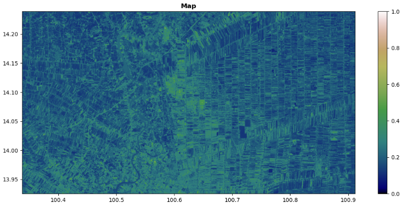
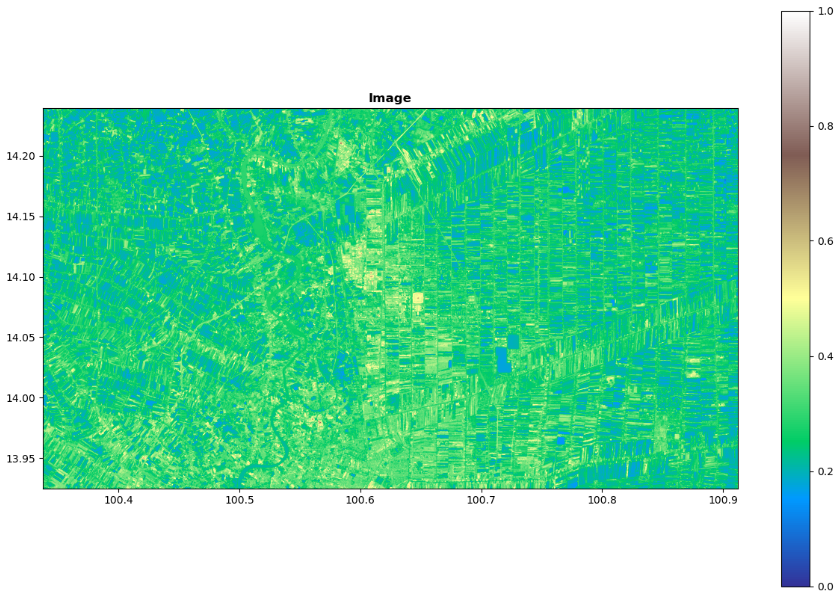
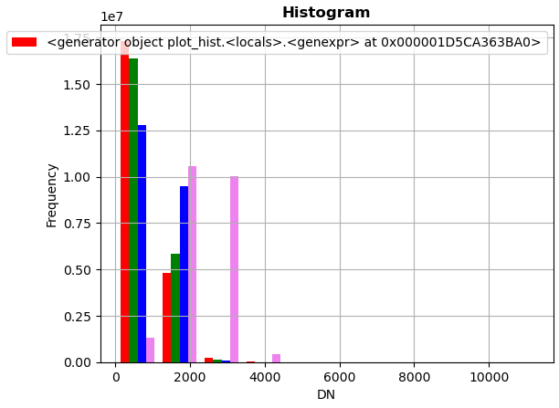
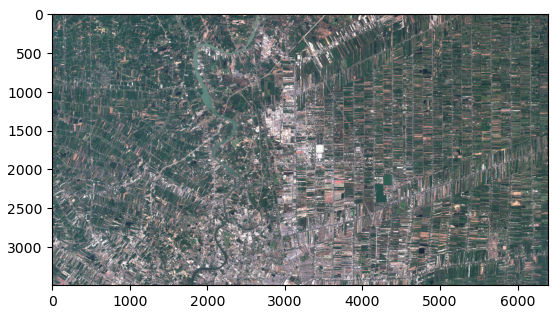
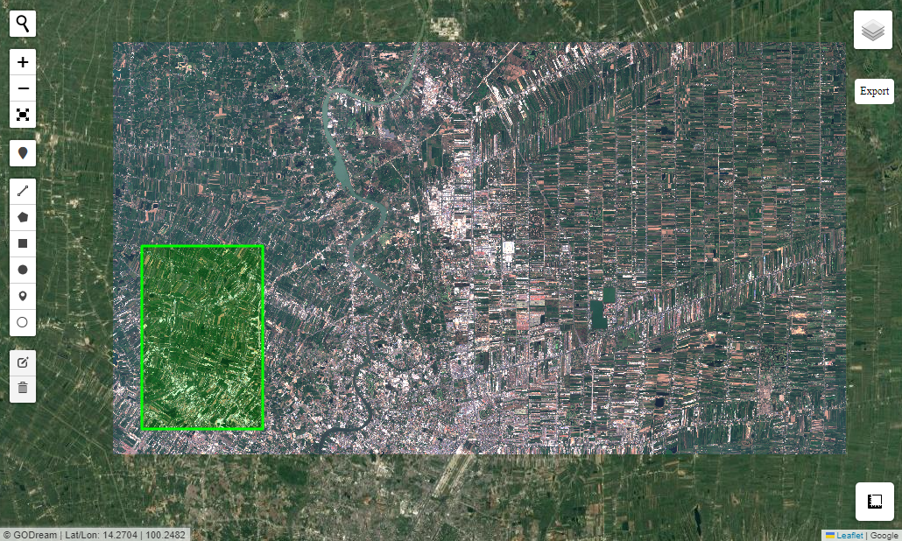

# Plot Raster 

Plot raster image

- plot_raster  : plot single band raster data.
- plot_hist : plot histogram of raster data.
- plot_multibands : plot multi-bands raster data.
- overlay_map : display raster data on interactive map.

### Load package


```python
import rasterio
from Godream.plotimg import plot_raster, plot_hist
```


```python
input_img = "data/S2_image3.tif"

ds=rasterio.open(input_img)
```

### Explore data


```python
ds
```


<open DatasetReader name='data/S2_image3.tif' mode='r'>


```python
data = ds.read()

```


```python
dd=ds.bounds
dd
```


BoundingBox(left=100.33732565972996, bottom=13.92514454525035, right=100.9118881154528, top=14.239105737050123)


```python
ds.crs
```


CRS.from_epsg(4326)


```python
ds.meta
```


{'driver': 'GTiff',
 'dtype': 'uint16',
 'nodata': None,
 'width': 6396,
 'height': 3495,
 'count': 4,
 'crs': CRS.from_epsg(4326),
 'transform': Affine(8.983152841195215e-05, 0.0, 100.33732565972996,
        0.0, -8.983152841195215e-05, 14.239105737050123)}


```python
ds.name
```


'data/S2_image3.tif'


### Plot single band

This tools will read and plot only first band of raster image. Thus, This tools is just suitable for image visualzation. 


```python
plot_raster(ds, title="Map", adjust=True, figsize=(15,6), gamma=0.6)
```


<!--  -->

 
```python
plot_raster(ds,cmap='terrain', title="Image")
```


<!--  -->

### Plot histogram


```python
plot_hist(ds, bins=10, title='Histogram')
```


<!--  -->

### Plot Multi-bands

- bands : sequence of image bands (R,G,B), defualt is [3, 2, 1].

- brightness : The brightness of image, defualt is 0.85.

```python
from Godream.plotimg import plot_multibands

raster_file = "D:\DGEO\data\S2_image3.tif"
plot_multibands(raster_file, bands =[3,2,1], brightness=0.90)
```


<!--  -->

### Export raster


```python
with rasterio.open(r"D:\DGEO\output\output.tif",'w', 
                   driver= ds.driver,
                   height=ds.height,
                   width=ds.width,
                   count=ds.count,
                   crs=ds.crs,
                   transform=ds.transform,
                   dtype=data.dtype
                   ) as dst:
    dst.write(data)
```

### Display raster image

This tools can show both raster and vector data on Interactive Map.

The CRS of this tools is EPSG:4326.


```python
from Godream.plotimg import overlay_map
```


```python
# set path to be input
input_path='D:\DGEO\data\S2_image3.tif'
clip_path = 'D:\DGEO\data\Rectan.geojson'
output_path= 'D:\DGEO\data\Raster_clip.tif'
# set parameter for function
filev = [clip_path]
filer = [input_path,output_path]
```


```python
overlay_map( filev, filer, with_draw_tools=True, zoom=None, , opacity = 1.0)
```




