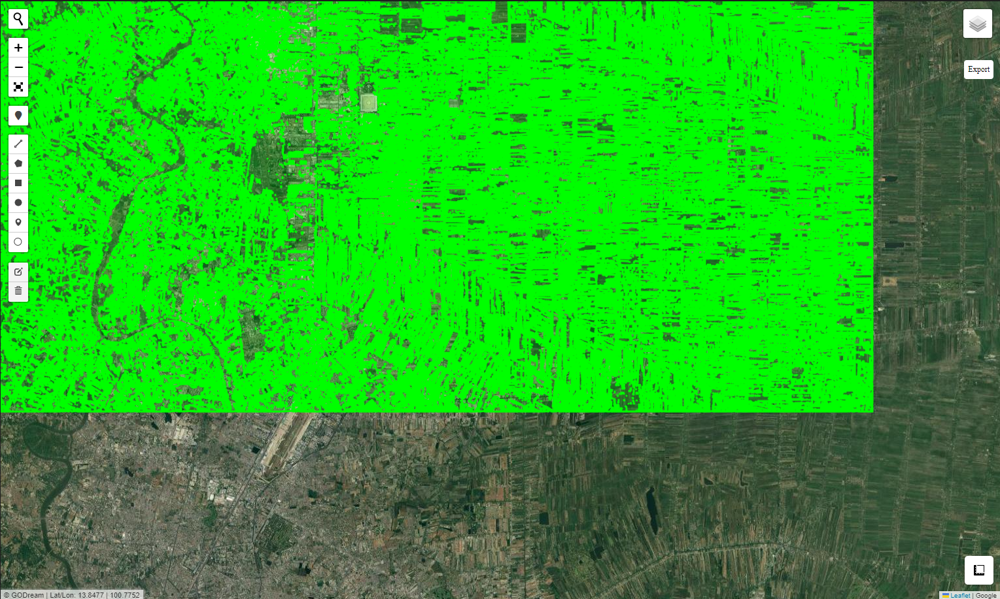
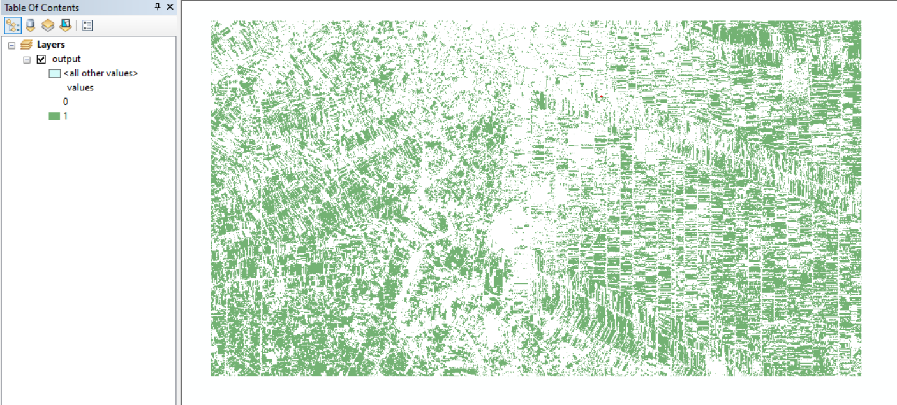

# Vectorize

This is function to convert raster image to vector file.

### Import packages


```python
from Godream.plotimg import overlay_map
from Godream.convertool import raster2polygon
```

### Set input/output path

This input file is raster image from the classification output in [ML classification](https://dreamptk.github.io/Godreamwebsite/ML/)


```python
file_name ='output.tif'
out_shp_fn = 'output.shp'

```

### Convert raster to 

It might take several minute to get the vector result depend on the number of polygon created.


```python
raster2polygon(file_name, out_shp_fn, band_number=1, field_name="values")
```

     * info: creating integer raster to Polygonize:
       >> output_int.tif
    Success: Wrote output.shp
    

### Explore output


```python
overlay_map(vector_file=[out_shp_fn], zoom=10)
```



### Or display in ArcMap software


