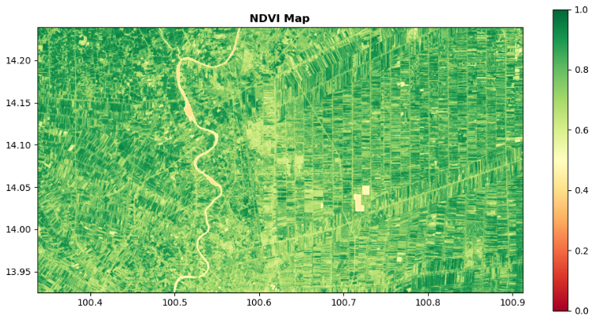

# Band Indices

There are around 10 indice available for this tools. it consist of NDVI, GNDVI, DVI, LAI, RVI, SAVI, MSAVI, NDWI, EVI, BAI.

This tools automatic export output file in Geotiff.

### Import package


```python
import rasterio
from Godream.indices import cal_indinces
from Godream.plotimg import plot_raster
```

### Set file path


```python
# input
file_name = "D:/DGEO/data/Landsat8_allB4326.tif"

#output
out_name = "D:/DGEO/data/Landsat8_allB4326_ndvi.tif"
```

### Calculate index

This case study select NDVI to represent how to use the tool to create band index.

For `sentinel2` [band2: Blue, band3: Green, band4: Red, band8: nir, band11:swir] 

For `landsat8` [band2: Blue, band3: Green, band4: Red, band5: nir, band6:swir] 

```python
# use function to calculate index
ndvi = cal_indinces(tiff_path=file_name, index='NDVI', output_path=out_name, satellite = 'landsat8')

# see output
ndvi
```


        array([[0.69406151, 0.69681129, 0.68789144, ..., 0.51768116, 0.45603015,
                0.4510582 ],
               [0.69532045, 0.68777015, 0.70171026, ..., 0.52957359, 0.49478079,
                0.46151369],
               [0.71372453, 0.70889894, 0.69785276, ..., 0.57792041, 0.53982301,
                0.48290598],
               ...,
               [0.67156741, 0.66096579, 0.60215054, ..., 0.39926471, 0.44931583,
                0.36670688],
               [0.66796368, 0.66885411, 0.65086765, ..., 0.39217877, 0.57319953,
                0.48277039],
               [0.64482482, 0.65219679, 0.6747645 , ..., 0.4274226 , 0.55710956,
                0.53986486]])


### Plot raster output


```python
# open file
ds=rasterio.open(out_name)

# plot image
plot_raster(ds, cmap='RdYlGn', title="NDVI Map", adjust=True, figsize=(12,6), gamma=0.8)
```

<!--  -->
