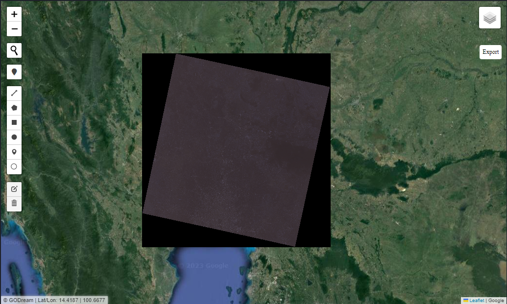

# Stacking

Band stacking or image stacking

### Load Package


```python
from Godream.geobox import stack_bands
```

### Band Stacking 


```python
band1='D:\DGEO\data\L8_B1.TIF'
band2='D:\DGEO\data\L8_B2.TIF'
band3='D:\DGEO\data\L8_B3.TIF'
band4='D:\DGEO\data\L8_B4.TIF'
band6='D:\DGEO\data\L8_B6.TIF'
```


```python

band_paths =  [band1, band2, band3]
output_path =  "D:\DGEO\data\Landsat8_stack.TIF"

stack_bands(band_paths, output_path)
```

### Explore output


```python
import rasterio
ds= rasterio.open("D:\DGEO\data\Landsat8_stack.TIF") 
ds
```


<open DatasetReader name='D:/DGEO/data/Landsat8_stack.TIF' mode='r'>


```python
dd=ds.read()
# dd
```


```python
ds.meta
```


        {'driver': 'GTiff',
         'dtype': 'uint16',
         'nodata': None,
         'width': 7551,
         'height': 7711,
         'count': 3,
         'crs': CRS.from_epsg(32647),
         'transform': Affine(30.0, 0.0, 575085.0,
                0.0, -30.0, 1714215.0)}


Open in  "overlay_map" but need to change CRS to EPSG:4326


```python
from Godream.plotimg import overlay_map, show_map
```


```python
path =  ["D:\DGEO\data\Landsat8_4326.TIF"]
overlay_map(raster_file=path)
```




