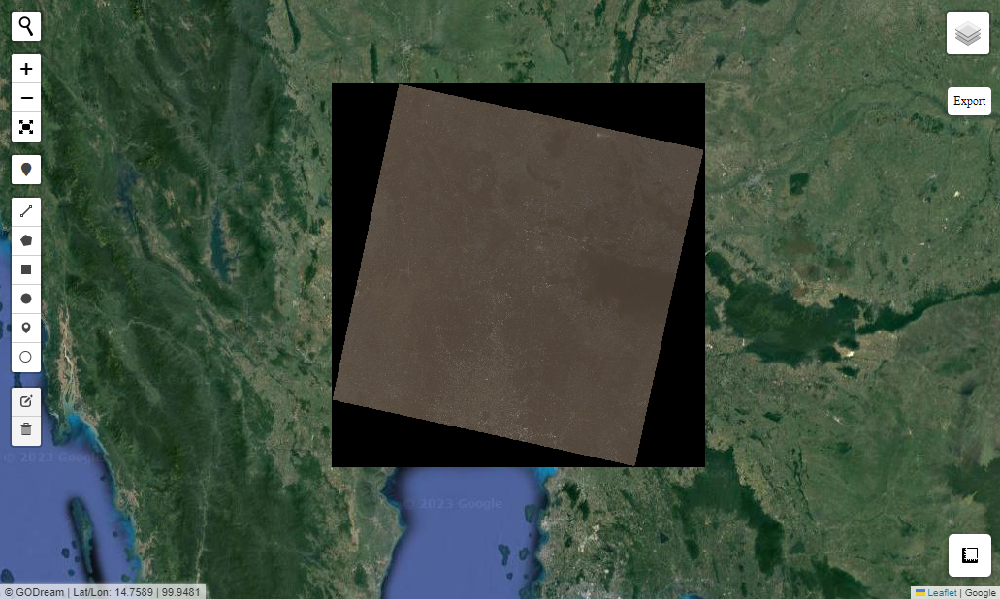

# Conversion

Convert Tools for GIS

- convert file format from shp to geojson or geojson to shp
- convert the CRS of vector and raster file


### Import package


```python
import geopandas as gpd 
import rasterio as rio
from Godream.plotimg import overlay_map
from Godream.convertool import convert_crs, convert_format
```

### Convert file format

This tool work for vector data to convert file formate from shp to geojson or geojson to shp.


```python
# set input/output
input_path = 'D:\DGEO\data\Rectan.geojson'
output_path = 'D:\DGEO\data\Rectan.shp'
output_format = 'ESRI Shapefile'
```

#### Convert file format Tool 

This example, convert from `geojson to shp` file format.

If you want to convert from `shp to geojson` format.  Please change this one:
 
`output_format = 'GeoJSON'`

and change `input_path` and `output_path` follow your approach.


```python
convert_format(input_path, output_path, output_format)
```

#### Explore result


```python
# read file
gdf = gpd.read_file(output_path)

CRS_file = gdf.crs
Info = gdf.info()

print(CRS_file,Info)
```

    <class 'geopandas.geodataframe.GeoDataFrame'>
    RangeIndex: 1 entries, 0 to 0
    Data columns (total 2 columns):
     #   Column    Non-Null Count  Dtype   
    ---  ------    --------------  -----   
     0   FID       1 non-null      int64   
     1   geometry  1 non-null      geometry
    dtypes: geometry(1), int64(1)
    memory usage: 144.0 bytes
    epsg:4326 None
    

### Convert CRS

Convert Geographic Coodinate System(CRS)

This example will change the crs from `EPSG:32647` to `EPSG:4326`


```python
# set input/output path
input_path = 'D:\DGEO\data\Landsat8_stack.TIF'  # Replace with the path to your input GeoTIFF file
output_path = 'D:\DGEO\data\Landsat8_stack44.tif'  # Replace with the desired output file path
new_crs = 4326  # EPSG:4326
```

#### Explore CRS of file input

You can see the crs of input file is `EPSG:32647`


```python
# read file
ds=rio.open(input_path)

# see metedata
ds.meta
```


    {'driver': 'GTiff',
     'dtype': 'uint16',
     'nodata': None,
     'width': 7551,
     'height': 7711,
     'count': 3,
     'crs': CRS.from_epsg(32647),
     'transform': Affine(30.0, 0.0, 575085.0,
            0.0, -30.0, 1714215.0)}


#### Convert CRS Tool 


```python
convert_crs(input_path, output_path, new_crs)
```


#### Explore result

Now the crs of output is `EPSG:4326`


```python
# read file
ds=rio.open(output_path)

# show meta data to see the result crs
ds.meta
```


    {'driver': 'GTiff',
     'dtype': 'uint16',
     'nodata': None,
     'width': 7712,
     'height': 7670,
     'count': 3,
     'crs': CRS.from_epsg(4326),
     'transform': Affine(0.00027457111894358207, 0.0, 99.69355065482286,
            0.0, -0.00027457111894358207, 15.504185371111015)}


```python

raster_path = [output_path]
overlay_map(raster_file=raster_path, zoom=9)
```




