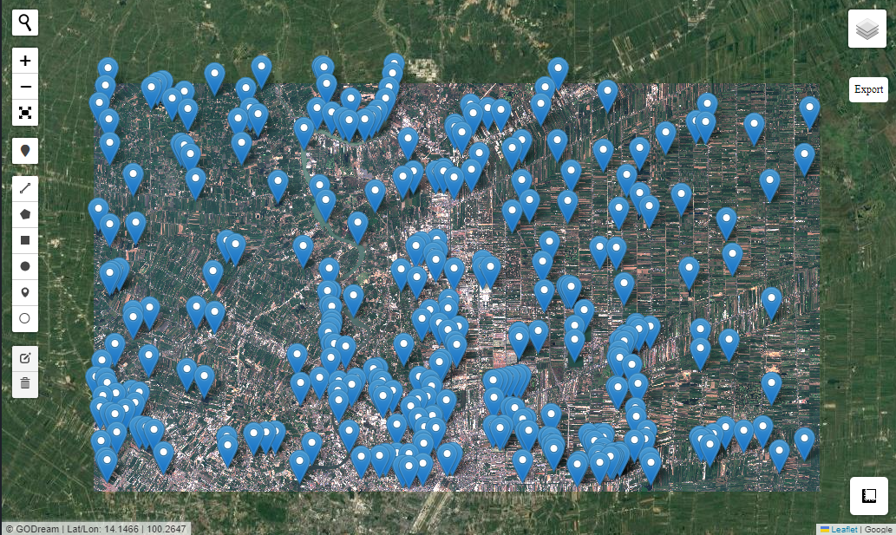
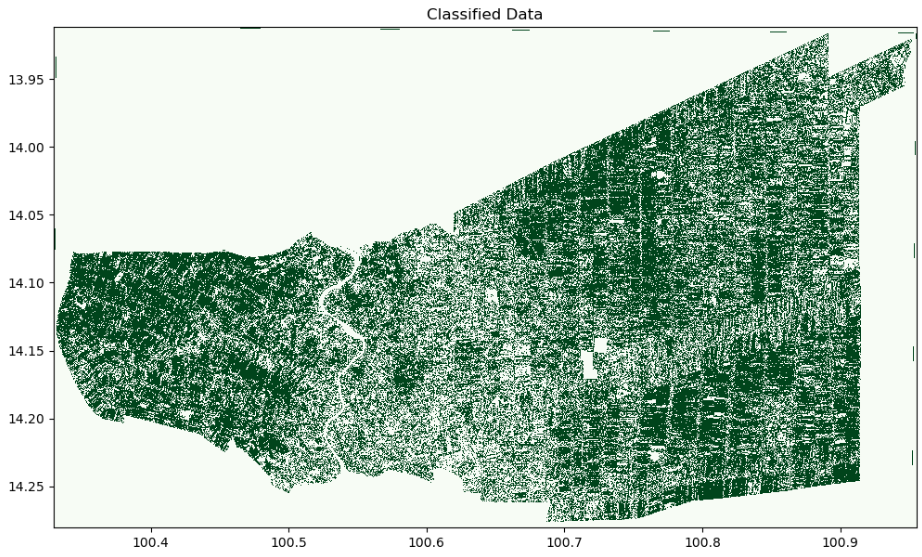

# Rice Detect

### Import package


```python
import rasterio
from Godream.plotimg import overlay_map
from Godream.model import riceByOptical, riceBySar
```

### For Optical image

Your sateelite image bands have to set the order of bands like this: 

`band_1` as red band

`band_2` as green band

`band_3` as blue band

`band_4` as nir band

```python
#set input
trainset = 'data/trainset_DN.geojson'
raster_img = "data/S2_image3.tif"
output_tiff = 'classified_S2.tiff'
```


```python
# visualize input
filev = [trainset]
filer = [raster_img]
overlay_map( filev, filer, with_draw_tools=True,zoom=None )
```




#### Optical rice model

Raster images should have 4 bands that compose of red, green, blue and nir bands respectively.

```python
riceByOptical(raster_img, output_tiff, figsize = (12, 7), num_estimator = 100)
```


<!--  -->


### For SAR image

```python
# set input parameter
raster_stack = "D:\DGEO\myDATA\VH_stack.tif" # SAR_VH stack 19 images
output_tiff = 'classified.tiff'
```

#### SAR rice model
This model uses time series data of SAR VH polarization to run the model. Thus, input data should be stack 19 images of SAR VH polarization images.

```python
riceBySar(raster_stack, output_tiff, figsize = (12, 7), num_estimator = 100 )
```


<!--  -->
